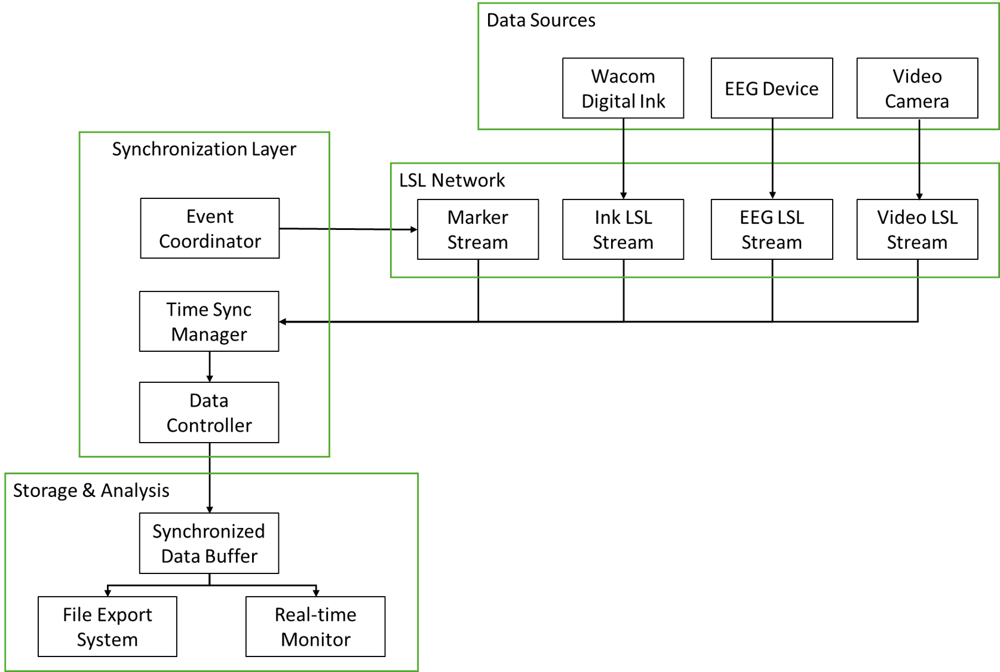

# 繪畫影片EEG同步收集平台 - 專案流程規劃
## 專案概述
本專案旨在開發一個多模態數據同步收集平台，能夠同時記錄：
* 數位墨水數據：繪圖過程中的筆跡軌跡、壓力、傾斜等
* EEG腦電信號：繪畫過程中的大腦活動
* 影片記錄：繪畫行為的視覺記錄
透過LSL（Lab Streaming Layer）技術實現亞毫秒級的時間同步，為神經科學研究提供高精度的多模態數據。

## 第一階段：數位墨水數據讀取與處理
### 目標
建立穩定的數位墨水數據處理管線，能夠即時處理Wacom繪圖板的輸入數據。
### 關鍵技術
* Universal Ink Library：使用Wacom官方提供的通用墨水函式庫
* 即時數據處理：多執行緒架構處理高頻率輸入數據
* 筆劃檢測：自動識別筆劃開始、進行中、結束狀態
### 主要功能
* 數據擷取：從繪圖設備獲取原始座標、壓力、傾斜角度
* 特徵計算：即時計算筆速、加速度、筆劃長度等衍生特徵
* 事件檢測：識別筆劃邊界、暫停、重新開始等繪畫事件
* 數據緩衝：建立高效的數據緩衝機制，避免數據丟失
### 預期輸出
* 結構化的墨水點數據（座標、壓力、時間戳）
* 筆劃層級的統計資訊（長度、持續時間、平均壓力）
* 繪畫事件標記（開始、結束、暫停）

## 第二階段：建立繪圖過程的LSL Stream
### 目標
將處理後的數位墨水數據轉換為LSL串流格式，實現與其他設備的時間同步。
### 關鍵技術
* LSL串流協議：建立符合LSL標準的數據串流
* 時間戳同步：使用LSL統一時間基準
* 事件標記系統：創建結構化的實驗事件標記
### 主要功能
* 串流建立：
  * 墨水數據串流（8通道：x, y, pressure, tilt_x, tilt_y, velocity, stroke_id, event_type）
  * 事件標記串流（筆劃開始/結束、任務階段標記）
* 數據格式化：
  * 標準化座標系統（0-1範圍）
  * 統一時間戳格式
  * 設備metadata設定
* 品質控制：
  * 數據完整性檢查
  * 串流延遲監控
  * 錯誤處理機制
* 預期輸出
  * 即時LSL墨水數據串流
  * 同步的事件標記串流
  * 串流品質報告

第三階段：同步串流EEG與影片數據
### 目標
整合所有數據源，建立完整的多模態同步收集系統。
### 關鍵技術
  * 多串流同步：協調EEG、墨水、影片三種數據源
  * 時間對齊算法：後處理時間同步校正
  * 即時監控系統：實驗過程中的數據品質監控
### 主要功能
3.1 EEG數據整合
  * 自動偵測EEG設備LSL串流
  * EEG數據品質即時監控
  * 繪畫事件的時間對齊
3.2 影片同步記錄
  * 高解析度影片錄製（可設定fps和解析度）
  * 影片幀時間戳LSL串流
  * 影片與其他數據的時間同步
3.3 實驗控制系統
  * 實驗階段管理：基線期、繪畫任務、休息期
  * 事件標記系統：任務開始/結束、特殊事件標記
  * 即時數據監控：各串流狀態、同步品質檢查
3.4 數據匯出與分析
  * 同步數據匯出：CSV、JSON、HDF5格式
  * 時間對齊報告：同步精度分析
  * 數據完整性檢查：遺失數據檢測與補償
### 預期輸出
  * 完整的多模態同步數據集
  * 實驗時間軸與事件標記
  * 數據品質與同步精度報告
## 技術架構
### 系統架構圖

### 關鍵技術指標
* 時間同步精度：< 1ms
* 數據採樣率：
  * EEG：250-1000 Hz
  * 數位墨水：100-200 Hz
  * 影片：30-60 fps
* 延遲控制：端到端延遲 < 10ms
* 數據完整性：> 99.9%
## 實作時程規劃
### Phase 1（2週）：數位墨水處理
* Universal Ink Library整合
* 基本數據處理管線
* 筆劃檢測算法實作
### Phase 2（2週）：LSL串流建立
* LSL串流架構設計
* 事件標記系統
* 初步同步測試
### Phase 3（3週）：多模態整合
* EEG串流整合
* 影片同步系統
* 完整實驗控制介面
### Phase 4（1週）：測試與優化
* 系統整合測試
* 效能優化
* 文件撰寫

